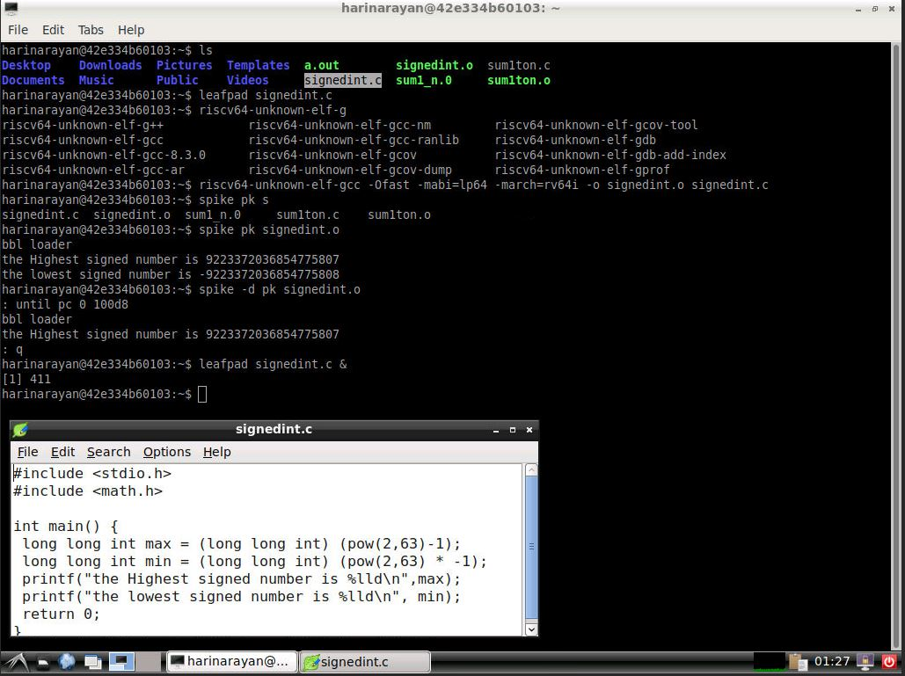

# RISC-V_MYTH_Workshop - Creating a Simple RV64I RISC-V Processor Design Using TL-Verilog

This repository contains all the information needed to build a simple RISC-V processor to have a basic RV64I instruction set implemented and testing it with a simple C code to have a sum of numbers from 1 to 10 and test the functioning of the Created RISC-V processor. 

# Table of Contents
- [Introduction to  RISC V ](#What-is-RISC-V?)
- [Day 1 Instruction Set Architecture & GNU Toolchain.](#Day-1-Instruction-Set-Architecture-&-GNU-Toolchain)
- [Day 2 Application Binary Interface and basic verification flow.](#Day-2-Application-Binary-Interface-and-basic-verification-flow)
- [Day 3 Introduction to TL Verilog and Makerchip.](#Day-3-Introduction-to-TL-Verilog-and-Makerchip)
- [Day 4 RISCV CPU Core Implementation.](#Day-4-RISCV-CPU-Core-Implementation) 
- [Day 5 Pipelining the RISCV Core.](#Day-5-Pipelining-the-RISCV-Core)
- [Acknowledgements.](#Acknowledgements)

# Introduction to  RISC V
RISC-V is an open source instruction set architecture(ISA) based on reduced instruction set computing concept.Unlike other existing commercial ISAs, the RISC-V ISA is open and this makes it easy and flexible for anyone to build a processor that supports it. 
Notable features of the RISC-V ISA include a load–store architecture, bit patterns to simplify the multiplexers in a CPU, IEEE 754 floating-point, a design that is architecturally neutral, and placing most-significant bits at a fixed location to speed sign extension. The instruction set is designed for a wide range of uses. It is variable-width and extensible so that more encoding bits can always be added. It supports three word-widths, 32, 64, and 128 bits, and a variety of subsets. The definitions of each subset vary slightly for the three word-widths. The subsets support small embedded systems, personal computers, supercomputers with vector processors, and warehouse-scale 19 inch rack-mounted parallel computers.
The instruction set space for the 128-bit stretched version of the ISA was reserved because 60 years of industry experience has shown that the most unrecoverable error in instruction set design is a lack of memory address space. As of 2016, the 128-bit ISA remains undefined intentionally, because there is yet so little practical experience with such large memory systems There are proposals to implement variable-width instructions up to 864 bits long, 27 times the usual length.

# Day 1 Instruction Set Architecture & GNU Toolchain.
  This was a brief session to give us overview of how the higher level languages are converted to assembly and then into machine/binary format, in a hierarchical level was given. Following which basics of the various types of instructions which are as follows:
  
  - **RV64I** or RV32I Base integer instructions: 64 and 32 bit data instructions respectively
  - **RV64M** i.e Multiply extension
  - **RV64IM** : Includes base and multiple extension.
  - **RV64F** and **RV64D** : Floating point and Double extenstion. 
  
  In  Addition concepts about the integer number representation and their maximum and minimum ranges was discussed.
  
  - Integer: 
    - Word i.e. 32 bits.
    - Double word i.e 64 bits
    - RV64 has range 0 to (264 - 1)
    
  - Negative i.e signed numbers:
    - Range is - 263 to (263 - 1)
    
    The instructions which work on these numbers are called Base Integer Instruction **RV64I**.
  
## Lab 1 : C program of Sum 1 to n  numbers.
  A basic C program to calculate sum of natural numbers upto a limit provided by the user.  
  - Command used to compile the C program is `gcc <filename.c>` or `gcc -o <binary file name> <filename.c>`and to run we use `./a.out` or `./<binary file name>` 

## Lab 2 : C program of Sum 1 to n  numbers, RISC-V toolchain.
  The same C program is now compiled using RISC-V toolchain. 
  - Command used to compile the C program is `riscv64-unknown-elf-gcc -O1 -mabi=lp64 -march=rv64i -o sum1ton.o sum1ton.c` or 
    `riscv64-unknown-elf-gcc -Ofast -mabi=lp64 -march=rv64i -o sum1ton.o sum1ton.c`.
  - To view to disassemble and view the object file in readable format,we use `riscv64-unknown-elf-objdump -d sum1ton.o` command.
  - To run we use spike which is a RISC-V simulator, following is the command `spike pk sum1ton.o`.
  - Spike has a debugging feature too which can be used to run it in steps, following is the command `spike -d pk sum1ton.o`.
  
  

## Lab 3 : Max and Min number representations. 
  A C program is implemented to  show the maximum and minimum sizes for RV64I. 
  - Commands used are same as Lab 2

  **Output on console**
  

# Day 2 Application Binary Interface and basic verification flow.
   Day 2 delves deep into the lower layers on how the higher layer instructions in c are translated to machine understandable codes. 
  Just like how application program interface (API) is used by application programs to access the standard libraries, an application binary interface or system     call interface is utilised hardware resources . The ISA is inherently divided into two parts: *User & System ISA* and *User ISA*  the latter is available to the   user directly by system calls. 
  
  Now, how does the ABI access the hardware resources? 
  - It uses different registers(32 in number) which are each of width `XLEN = 32 bit` for RV32 (~`XLEN = 64 for RV64`) . On a higher level of abstraction these       registers are accessed by their respective ABI names.
  
  For base integer instructions there are broadly 3 types of of such registers:
  - I-type : For instructions having immediate values as operands.
  - R-type : For instructions having only registers as operands.
  - S-type : For instructions used for storing operations.
  
## Lab 1 : ASM & ABI function Calls
  A new program is made by modifying the original `sum1ton.c` and adding ASM and ABI function call .
  - Command used to compile the program is `riscv64-unknown-elf-gcc -Ofast -mabi=lp64 -march=rv64i -o 1to9_custom.o 1to9_custom.c load.S`. 
  - To view to disassemble and view the object file in readable format, we use `riscv64-unknown-elf-objdump -d 1to9_custom.o|less`.
  - To run we use spike which is a RISC-V simulator, following is the command `spike pk 1to9_custom.o`.
  
  **Output on console**

# Day 3 Introduction to TL Verilog and Makerchip. 
  An introduction to TL-Verilog was done and we implemented basic combinational and sequential logic using the same.This day finally ended with an implementation of a sequential cyclic calculator. Makerchip IDE which is an open source tool developed by Redwood EDA was utilised.
  
  TL-Verilog is an extension for System Verilog, moreover it acts as an higher level abstraction for System verilog which makes HDL implementation very easy and error free. Here we deal the design at a transaction level assuming the design as a pipeline, where inputs would be provided and output will be generated at the end of the pipeline. 
  
  **Advantages** : 
   - Code reduction , and thus less chances of being bug prone.
   - In pipelining ,the flip flops,registers and other staged signals are implied from the context. 
   - It is very easy to stage different sections without impacting the behaviour of the logic.
   - Validity feature which provides easier debugging, cleaner design, automated clock gating and better error checking capabilities.
 
 ## Lab: 1 Simple counter logic 
      THis lab is to understand the TL-Verilog coding style using a simple counter logic to be built and tested. 
  **Makerchip IDE** 
   
    
  ## Lab: 1 Cycle Sequential Calculator 
   This Lab exercise is to advance to next stage to understand the basic of computing by creating a simple calculator function that computes all the calculation in the given single pipeline logic.

   **Makerchip IDE** 
   
   
## Lab: 2 Cycle Sequential Calculator 
   This Lab exercise is to advance to next stage to understand the basic of computing by creating a simple calculator function that computes all the calculation in the given two stage pipeline logic.This gives us a basic understanding of the pipeline stages to be used in design. The code can be found [here](https://github.com/RISCV-MYTH-WORKSHOP/risc-v-myth-workshop-august-harinarayan18/blob/master/Day3_5/calculator_solutions.tlv).

   **Makerchip IDE** 
   
   
     
# Day 4 RISCV CPU Core Implementation.
 On this day, the plan was to implement the following :
  
  - Program Counter (PC)
  - Imem-Rd ( Instruction Memory)
  - Instruction Decoder
  - Register File Read
  - Arithmatic Logic Unit (ALU)
  - Register File Write
  - Branch
  
  Thus the instruction set architecture of base integer instructions, The register file, branching,etc. and eventually the CPU core was built and tested(using appropriate testbench logic, and assembly code developed on Day 2) at the end of the day ,in similar progressive fashion like the previous day.The code can be found [here](https://github.com/RISCV-MYTH-WORKSHOP/risc-v-myth-workshop-august-harinarayan18/blob/master/Day3_5/risc-v_solutions.tlv).

  
   **RISC-V CORE**
   	
   
   
   
# Day 5 Pipelining the RISCV Core.
   Finally,we developed the pipelined model for the core developed on Day 4. 
   - A 3 cycle RISC V pipelined core, with all the base integer instruction sets was developed. 
   - For Load and store a Data memory element was added with neccessary instruction decoding logic.
   - Register Bypass and Squashing techniques were also incorporated to prevent `Read followed by write`
     and `branching`hazards, arised due to pipelining.
   - Testing of the pipeline design was done in same manner with Load and store incorporated in asm code.
   - Additionally Incorporation of Jump feature (JAL and JALR instructions) was also done.The code can be found [here](https://github.com/RISCV-MYTH-WORKSHOP/risc-v-myth-workshop-august-harinarayan18/blob/master/Day3_5/risc-v_solutions.tlv).
   
  
   **Final RISC V CPU Core**
   
   
   
   
# Acknowledgements
- [Kunal Ghosh](https://github.com/kunalg123), Co-founder (VSD Corp. Pvt. Ltd)
- [Steve Hoover](https://github.com/stevehoover), Founder, Redwood EDA.
